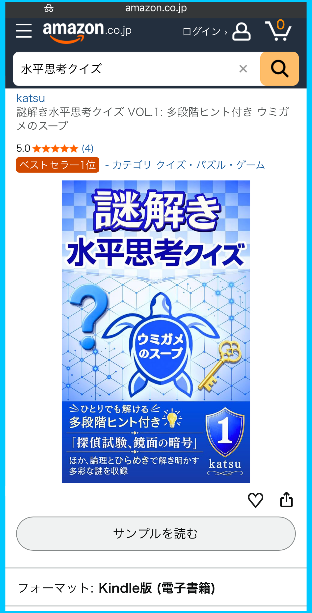

おかげさまで、Amazon の Kindleストアで出版した  
**『謎解き水平思考クイズ VOL.1: 多段階ヒント付き ウミガメのスープ』**  
が、**「クイズ・パズル・ゲーム」カテゴリの売れ筋ランキングで第 1 位**を記録しました。

※ 2026年9月3日時点の順位です。ランキングは随時変動します。

応援してくださった皆さま、ありがとうございます。

## Amazon 商品ページのランキング表示

  

## 本書の内容と無料サンプル

本書は、自作の水平思考クイズ（通称：ウミガメのスープ）50問を、約10〜20段階のヒント付きで、ひとりでも楽しめるようにした問題集です。

本書の内容や特徴については、以下の記事で紹介しています。

* {}

Amazon の商品ページでは無料サンプルも公開されています。  
**Kindle Unlimited** でもお読みいただけます。



{}

  <a class="btn-amazon"
    style="display: inline-block; width: 100%; max-width: 400px; padding: 14px 0; box-sizing: border-box;"
    href="https://www.amazon.co.jp/dp/B0GX2ZSKPD"
    target="_blank"
    rel="noopener"
    onclick="if(typeof gtag==='function'){gtag('event','click_amazon_link',{book_id:'umigame_vol1',link_location:'article_end',link_purpose:'product_page'});}">
    Kindleストアで見る
  </a>

{}

---
