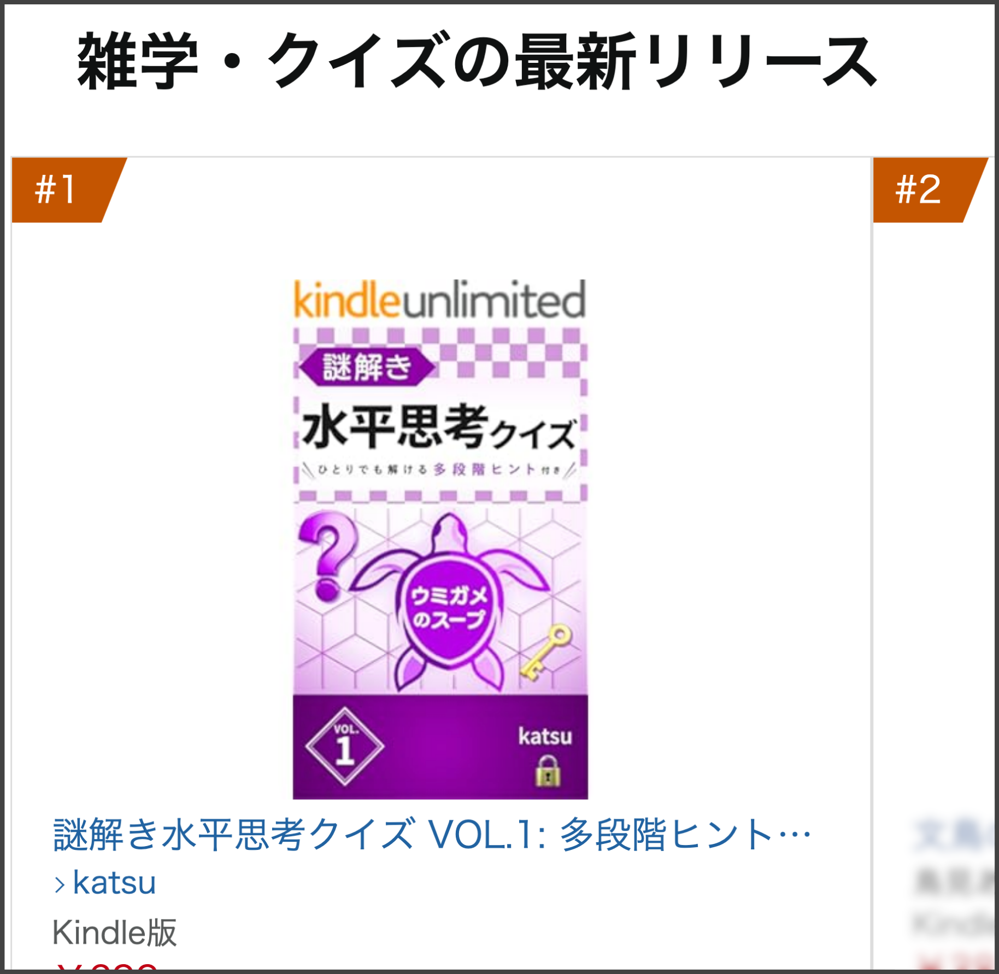
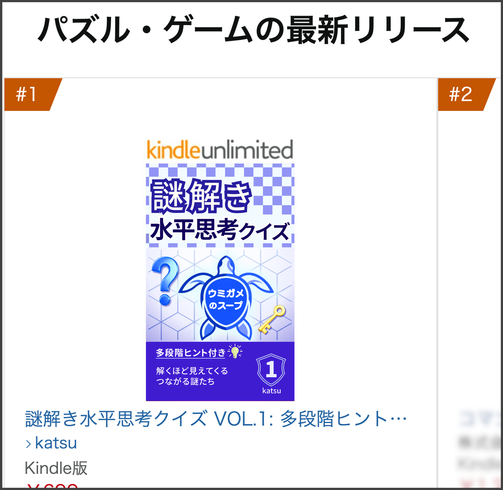

## Kindleストアの「最新リリース」2 部門で 1 位になりました

おかげさまで、Kindleで出版した  
**『謎解き水平思考クイズ VOL.1』** が、  
Kindleストアの「最新リリース」カテゴリで 1 位になりました。

* **雑学・クイズ — 最新リリース 第 1 位**
* **パズル・ゲーム — 最新リリース 第 1 位**

※ 2026年5月3日時点の順位です。

ご予約・ご購入・シェアなどで応援してくださった皆さま、本当にありがとうございます。

## ランキングのスクリーンショット

### 雑学・クイズの最新リリース

  

### パズル・ゲームの最新リリース

  

## 書籍の詳細はこちら

本書の内容や特徴、無料サンプルについては、以下の記事で紹介しています。

- {}

**Kindle Unlimited** でもお読みいただけます。

  <a class="btn-amazon"
    style="display: inline-block; width: 100%; max-width: 400px; padding: 14px 0; box-sizing: border-box;"
    href="https://www.amazon.co.jp/dp/B0GX2ZSKPD"
    target="_blank"
    rel="noopener"
    onclick="if(typeof gtag==='function'){gtag('event','click_amazon_link',{book_title:'umigame_vol1',link_location:'book_s1_page_v3',outbound:true});}">
    Kindleストアで見る
  </a>

---

本書を応援してくださる方は、SNS などでシェアしていただけると嬉しいです。

---
