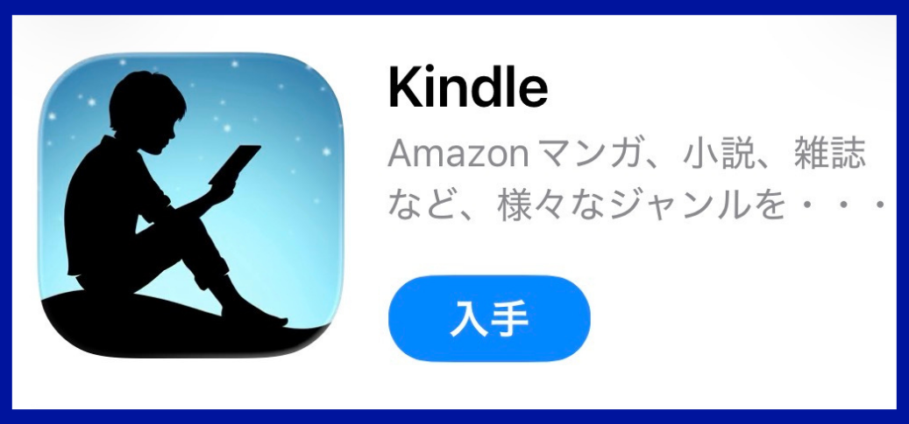
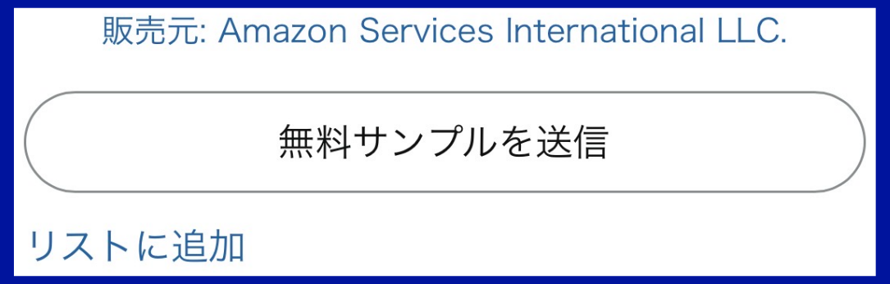

## 水平思考クイズ集の第1巻をKindleで出版しました
<!-- ## 水平思考クイズ集の第1巻をKindleで予約開始しました -->

多段階ヒント付きの水平思考クイズ集  
**『謎解き水平思考クイズ VOL.1: 多段階ヒント付き ウミガメのスープ』**  
を Amazon の Kindleストアで出版しました。
<!-- **『謎解き水平思考クイズ VOL.1』** の予約注文を Kindle で開始しました。 -->

ひとりでも楽しめるように、各問題に**約10〜20段階のヒント**を用意しています。  
すぐに答えを見るのではなく、必要なところだけ少しずつ開けながら、真相に近づける構成です。

## 本書の特徴

* 全50問を収録
* 各問題に約10〜20段階のヒント付き
* ひとりでも遊べる構成
* 解答後に「発想のポイント」で、真相にたどり着くための着眼点を振り返れる
* 対話形式でのテストプレイと調整を重ねた問題を収録

## こんな方に向いています

* 「なるほど」と納得できる水平思考クイズ (通称：ウミガメのスープ) を解きたい
* スキマ時間に、頭の体操を楽しみたい
* ひとりでも遊べる水平思考クイズ本を探している
* 推理や論理パズルが好き

## 書籍情報

* 書名：**『謎解き水平思考クイズ VOL.1: 多段階ヒント付き ウミガメのスープ』**  
* 形式：Kindle電子書籍
* 収録：全50問
* 特徴：各問に約10〜20段階のヒント付き
* 発売日：2026年4月30日

Amazon の商品ページでは、**無料サンプル**も公開されています。  
まずは冒頭の4問を解いて、問題やヒントの雰囲気をお確かめください。

<!-- * 現在：予約注文受付中 -->

<!-- ## 商品ページはこちら -->



<!-- background-color: #232F3E; color: #FFFFFF; -->

{}

  <a class="btn-amazon"
    style="display: inline-block; width: 100%; max-width: 400px; padding: 14px 0; box-sizing: border-box;"
    href="https://www.amazon.co.jp/dp/B0GX2ZSKPD"
    target="_blank"
    rel="noopener"
    onclick="if(typeof gtag==='function'){gtag('event','click_amazon_link',{book_id:'umigame_vol1',link_location:'book_info',link_purpose:'product_page'});}">
    Kindleストアで見る
  </a>

{}

## 無料サンプルの読み方

無料のKindleアプリを使って、スマートフォンやタブレットで本書の一部を試し読みできます。  
以下の3ステップで読めます。

### 1. Kindleアプリをインストールする

- iPhone／iPad： App Storeで **Kindle** を検索
- Android： Google Playで **Kindle** を検索

インストール後、Amazonアカウントでサインインします。

  

  
    App StoreでのKindleアプリのインストール画面
  

### 2. 無料サンプルを送信する

Amazonの商品ページで「**無料サンプルを送信**」をタップします。

  

### 3. Kindleアプリで読む

Kindleアプリを開き、ライブラリに表示された本書の表紙をタップすると、無料サンプルを読めます。  



{}

  <a class="btn-amazon"
    style="display: inline-block; width: 100%; max-width: 400px; padding: 14px 0; box-sizing: border-box;"
    href="https://www.amazon.co.jp/dp/B0GX2ZSKPD"
    target="_blank"
    rel="noopener"
    onclick="if(typeof gtag==='function'){gtag('event','click_amazon_link',{book_id:'umigame_vol1',link_location:'sample_guide_end',link_purpose:'free_sample'});}">
    無料サンプルを読む
  </a>

{}

---
