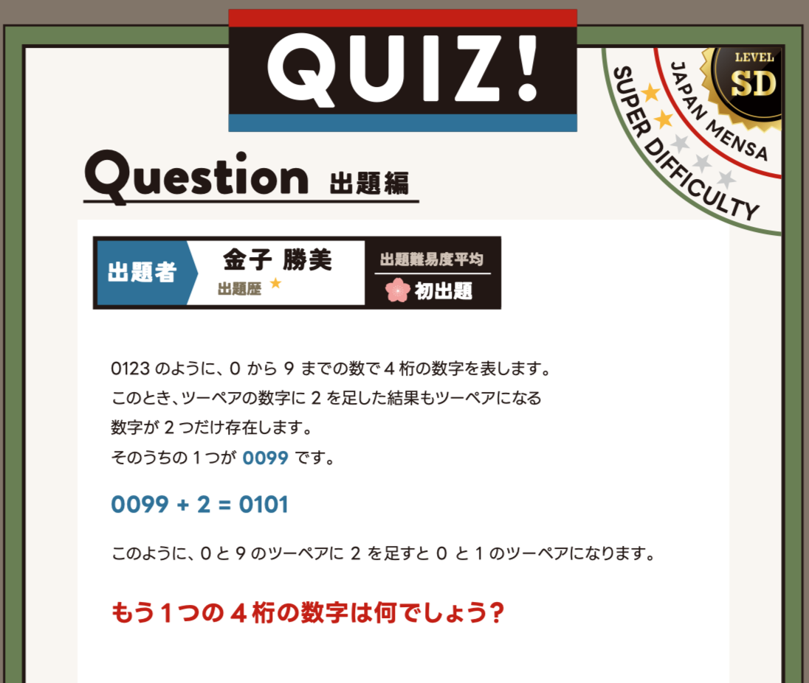

## はじめに

JAPAN MENSA の会報誌 (月報) には、会員から投稿されたクイズが掲載されるコーナーがあります。  
本記事では、私が実際に投稿して掲載されたクイズのうち1問を例に挙げ、制作時に意識している点についてまとめました。

※ 本記事に掲載しているクイズは、SNS 等への掲載が認められているものです。個人情報に関わる部分のみ加工しています。

## JAPAN MENSA と会報誌のクイズコーナー

MENSA は一定の基準を満たした人が参加する国際的な団体で、日本支部である JAPAN MENSA では、会員向けに会報誌 (月報) が発行されており、その中にクイズの投稿コーナーがあります。

会報誌のクイズは、知識量を競うものではなく、論理的な整理や発想力を問うものが中心です。  
解答を読んだあとに「そういうことか」と納得できる構成が重視されています。

<div class="gallery-image gallery-base">
  <a href="card.png" data-width="1500" data-height="1000">
    
  </a>
</div>

<span style="font-size: 0.9em;">
JAPAN MENSA 会員カード
</span>

---

## 今回紹介するクイズについて

今回投稿したのは、問題文に書かれている情報をそのまま整理すれば解けるタイプのクイズ (論理パズル) です。

いわゆる「前提を疑う」ことを要求するひっかけ問題ではなく、問題文の条件を落ち着いて読み取り、順序立てて考えることで、必ず解答にたどり着ける構成になっています。

初見の方でも、特別な知識を必要とせずに取り組める内容です。

### 会報誌掲載クイズ (問題文)

<div class="gallery-image gallery-base">
  <a href="quiz.png" data-width="1096" data-height="927">
    
  </a>
</div>

<span style="font-size: 0.9em;">
JAPAN MENSA 会報誌に掲載されたクイズ
</span>

以下は、画像と同内容の問題文です。

```
0123 のように、0 から 9 までの数で 4 桁の数字を表します。
このとき、ツーペアの数字に 2 を足した結果もツーペアになる数字が 2 つだけ存在します。
そのうちの1つが 0099 です。

0099 + 2 = 0101

このように、0 と 9 のツーペアに 2 を足すと 0 と 1 のツーペアになります。

もう 1 つの 4 桁の数字は何でしょう？
```

### 当クイズの考え方

このクイズは、ひらめき勝負というより「条件を一つずつ確かめる」ことで前に進みます。  
途中で勝手に条件を足さず、問題文にある情報だけで組み立てると、自然と答えに行き着く構造です。

## クイズ制作で大切にしているポイント

今回のような論理パズルを制作する際に、特に意識しているのは次の点です。

- 問題文だけで、必要な条件がそろうこと
- 読み手に余計な前提を置かせないこと
- 解答後に納得感が残ること

難しさよりも、「どう考えればよかったのか」が伝わることを重視しています。

## 今後について

本記事では、会報誌に掲載されたクイズの一例を紹介しました。  
こうしたクイズ制作の取り組みについては、しばらく前から別の形でも整理しています。  
機会があれば、また記事としてまとめる予定です。
