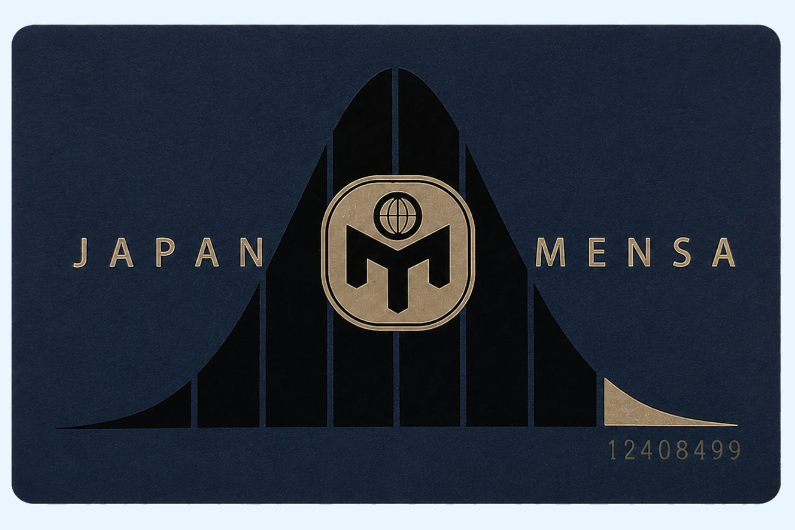
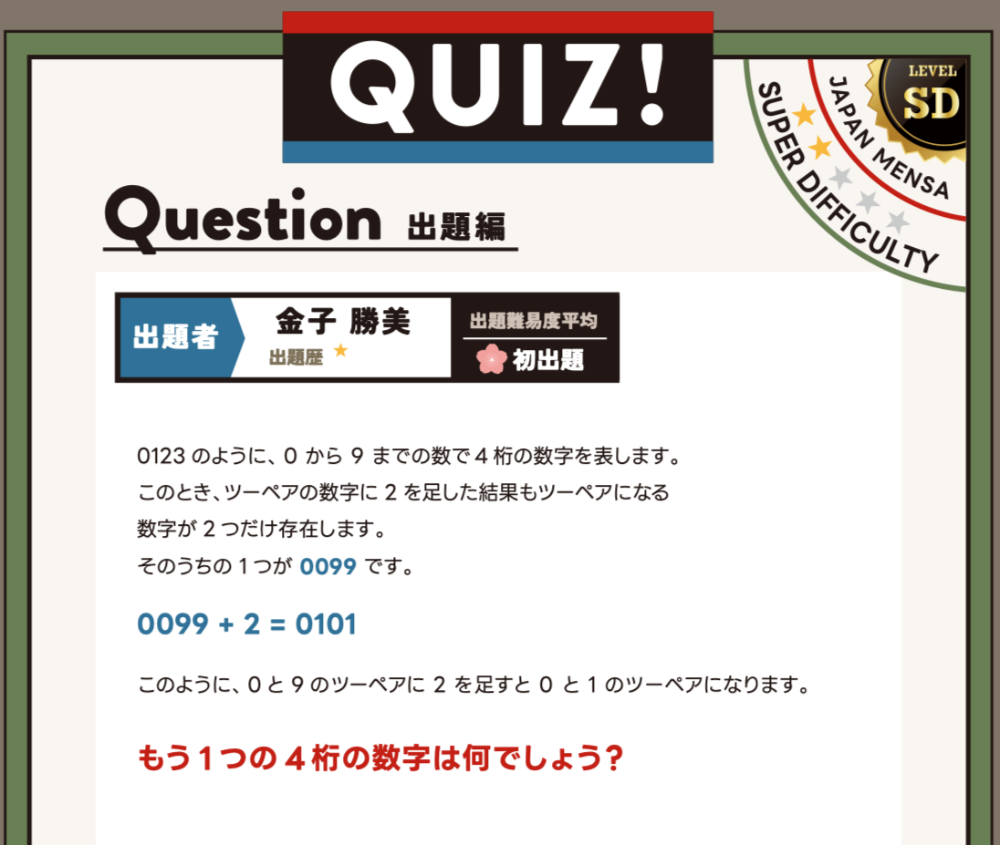

## はじめに

JAPAN MENSAの月刊会報誌には、「クイズのコーナー」が設けられています。  
本記事では、このコーナーに掲載された自作クイズの中から1問を紹介し、制作時に意識している点についてまとめます。

※ 本記事で紹介するクイズは、SNSなどへの掲載が認められているものです。個人情報に関わる箇所のみ加工しています。

## JAPAN MENSAと会報誌のクイズコーナー

MENSAは、所定の基準を満たした人が入会できる国際団体です。  
日本支部のJAPAN MENSAでは、会員向けに会報誌（月報）が発行されています。

会報誌には「クイズのコーナー」があり、掲載されるクイズは会員から募集されています。  
会員から寄せられた応募作品のうち、採用されたクイズが毎月1問、会報誌に掲載される仕組みです。  

会報誌のクイズは、知識量を競うものではなく、論理的な思考や発想力を問うものが中心です。  
解けたあとに「そういうことか」と納得できる構成が重視されています。

<div class="gallery-image gallery-base">
  <a href="card.png" data-width="1500" data-height="1000">
    
  </a>
</div>

<div style="text-align: center;">
  <span style="font-size: 0.9em;">
    JAPAN MENSA会員カード
  </span>
</div>

## 今回紹介するクイズについて

今回紹介するのは、会報誌のクイズコーナーに応募し、採用されたクイズ（論理パズル）です。  

いわゆる「前提を疑う」タイプのひっかけ問題ではありません。  
問題文の条件を落ち着いて読み取り、順序立てて考えることで、答えにたどり着ける構成になっています。

特別な知識を必要とせず、論理パズルに慣れていない方でも取り組みやすい内容です。

### 会報誌掲載クイズ（問題文）

<div class="gallery-image gallery-base">
  <a href="quiz.png" data-width="1096" data-height="927">
    
  </a>
</div>

<span style="font-size: 0.9em;">
JAPAN MENSA会報誌に掲載された自作クイズ
</span>

以下は、画像と同じ内容の問題文です。

```
0123 のように、0から9までの数で4桁の数字を表します。
このとき、ツーペアの数字に2を足した結果もツーペアになる数字が2つだけ存在します。
そのうちの1つが 0099 です。

0099 + 2 = 0101

このように、0 と 9 のツーペアに 2 を足すと 0 と 1 のツーペアになります。

もう1つの4桁の数字は何でしょう？
```

### このクイズの考え方

このクイズは、ひらめきだけで解くというより、条件を一つずつ確認しながら候補を絞り込んでいく問題です。  
問題文にない前提を加えず、提示された情報だけを順序立てて整理することで、答えを導けるようになっています。

## クイズ制作で大切にしているポイント

今回のような論理パズルを制作する際に、特に意識しているのは次の点です。

* 問題文の中に、解答に必要な条件がすべてそろっていること
* 問題文の表現によって、読み手に不要な思い込みを生じさせないこと
* 解答を知ったときに、納得感が残ること

難しさよりも、「どう考えればよかったのか」が伝わることを重視しています。

## 今後について

本記事では、会報誌に掲載された自作クイズの一例をご紹介しました。  
こうしたクイズは、会報誌への応募とは別に、作品としてまとめる準備も進めています。  
詳しくお知らせできる段階になりましたら、あらためて記事でご紹介します。

※ 2026年9月12日追記（参考記事）

ひとりでも楽しめる、多段階ヒント付きの水平思考クイズ集 (ウミガメのスープ) を出版しました。  
以下の記事で、収録内容や無料サンプルの読み方を紹介しています。

* {}

---
