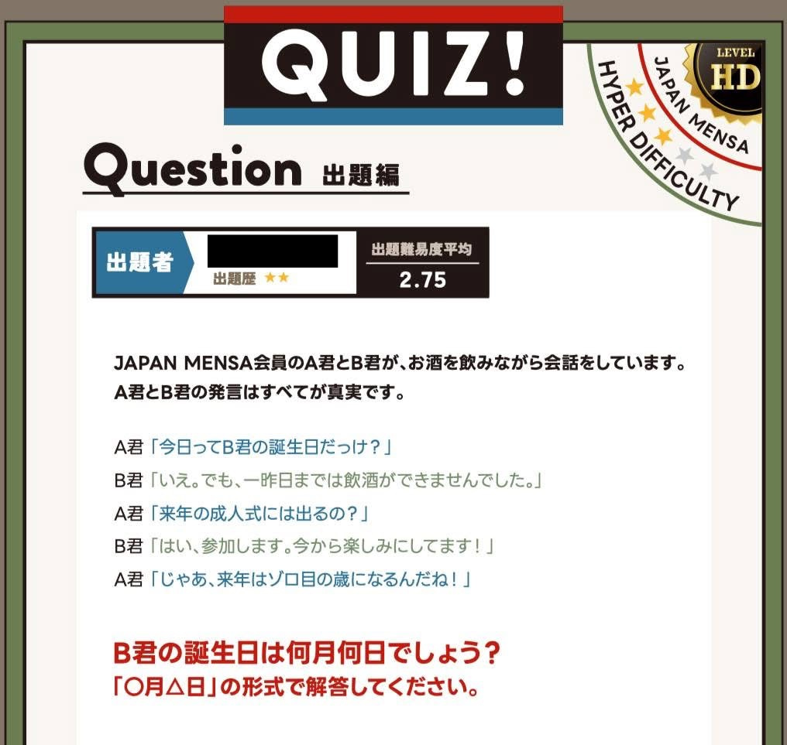

以前、JAPAN MENSA の月刊会報誌に、自作クイズを掲載していただきました。

今回紹介するのは、A君とB君の会話に含まれる条件から、B君の誕生日を導き出す論理パズルです。

※ 本記事に掲載しているクイズは、SNSなどへの掲載が認められているものです。個人情報に関わる部分のみ加工しています。

## 会報誌に掲載されたクイズ

<div class="gallery-image gallery-base">
  <a href="quiz-mensa-02.png" data-width="1016" data-height="963">
    
  </a>
</div>

<div style="text-align: center;">
  <span style="font-size: 0.9em;">
    JAPAN MENSA 会報誌に掲載された自作クイズ
  </span>
</div>

## 問題文

```
JAPAN MENSA会員のA君とB君が、お酒を飲みながら会話をしています。
A君とB君の発言はすべてが真実です。

A君「今日ってB君の誕生日だっけ？」
B君「いえ。でも、一昨日までは飲酒ができませんでした。」
A君「来年の成人式には出るの？」
B君「はい、参加します。今から楽しみにしてます！」
A君「じゃあ、来年はゾロ目の歳になるんだね！」

B君の誕生日は何月何日でしょう？
```

## 考えるときのポイント

このクイズでは、A君とB君の発言がすべて真実であることが重要です。

「今日」「一昨日」「来年」という時間に関する表現と、飲酒・成人式・年齢についての発言を、同じ時間軸の上で整理してみてください。

一見すると矛盾しているように感じる部分もありますが、すべての発言が同時に成立する日付を考えると、B君の誕生日を絞り込めます。

今回は、まず問題そのものを楽しんでいただけるよう、解答は掲載していません。  
頭の体操がてら、ぜひ挑戦してみてください。

## 前回紹介したクイズ

以下の記事では、会報誌に掲載された別のクイズと、クイズ制作で意識している点について紹介しています。

* {}

---
