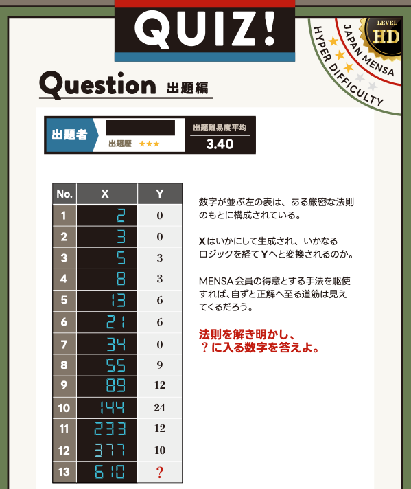

ありがたいことに、JAPAN MENSA の月刊会報誌に、新たな自作クイズを採用・掲載していただきました。  
これで、会報誌に掲載された自作クイズは通算3問となりました。

※ 本記事に掲載しているクイズは、SNSなどへの掲載が認められているものです。個人情報に関わる部分のみ加工しています。

## 会報誌に掲載されたクイズ

今回は、表に並んだ数字から法則を見抜き、「？」に入る数を導き出す論理パズル風の問題です。  
一見すると複雑そうですが、「ある視点」に気づくと、正解への道筋が見えてきます。

特別な予備知識は必要ありません。  
頭の体操がてら、ぜひ挑戦してみてください。

  

  
    JAPAN MENSA 会報誌に掲載された自作クイズ
  

「？」に入る数が分かったでしょうか。

今回は、まず問題そのものを楽しんでいただけるよう、解答は掲載していません。  
正解に気づいた方は、その法則が表全体で成り立っているか、もう一度確かめてみてください。

## これまでに紹介したクイズ

* {}
* {}

今後も、解いたあとに「そういうことか」と納得できる問題を目指して、クイズ・論理パズルの制作を続けていきたいと思います。

---
